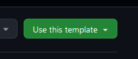

# Introduction to Multiversion Modding

*Hello, and welcome to multiversion hell!*

## Why Multiversion?

This template combines two different things---*multiversion* and *multiloader*.

Traditionally, if you want to support multiple Minecraft versions, you would need to create multiple Git branches for each version.
This can be a major pain if you are actively maintaining each one, so instead, *multiversion* Minecraft mods 
build all jars from a single branch, often called a *monorepo*.

Of course, you still need some way to separate version specific code. This is typically done with some kind of *preprocessor*,
which enables conditional compilation so that each Minecraft version target only includes the code that works for it.
While this makes Gradle scripts more complicated to set up and understand, it massively simplifies updates across many supported versions.
Fortunately, setting up Gradle is largely a one time operation, and this template takes care of most of it.

Likewise, if you wanted to support both Forge and Fabric, you would also need separated Git branches, and this can compound 
the maintenance problem when trying to support multiple versions as well. To make this easier, **multiloader** Minecraft mods build from one repo,
typically with a lot of shared code (since both modloaders are just Minecraft!). 

You've probably heard of Architectury, which is a multiloader Gradle setup that uses separated `common`, `forge`, and `fabric`
sourcesets. However, it's just simply cleaner to combine both, since they can both be set up with preprocessors to build from a single `src` directory.

Note that you don't actually need to do both multiloader and multiversion---you can remove one or the other and this setup will work the same.

## What's in Here?

This template uses [Stonecutter](https://stonecutter.kikugie.dev/), and is set up with the following:

- Documentation for every part of the build toolchain
- Fabric, Forge, and NeoForge in one sourceset
- Preconfigured support for all modern 'LTS' versions, in one sourceset (1.18.2, 1.19.2, 1.20.1, 1.21 by default, other versions can be added)
- GitHub Actions workflows to automatically deploy published jars
- Mojang Mappings with Parchment
- Mixins for both platforms
- Access Wideners (automatically converted to Forge Access Transformers)
- Cross-platform Forge Config (FC API Port)
- Cross-platform Registrate

In addition to all that, I've also set up some helper scripts to make forking this template easier (more on that below),
and set up Manifold preprocessor directives (which are much easier to use than ReplayMod preprocessor).

## Who Can Use This?

This template is specifically built for the community! I want to encourage more people
to build mods this way, because it's better for everyone if projects are built with wide loader and version support from the start.

It is MIT licensed and allows anyone to fork and relicense, and it's easy to do so 
if you click the "Use this template" button in the top right corner:

You can also depend on my personal library, [TxniLib](/lib), which contains some multiloader/multiversion
abstractions that I find helpful. I do my best to document it, though it isn't a top priority.

However, this is definitely a more advanced project setup, and I would not recommend it to someone just getting started
on mod development. If you are not already familiar with both Forge & Fabric toolchains, events, APIs, etc, you will
likely have a harder time getting things working because of the barrier to entry inherent with multiloader mods.

With that said, I hope this readme covers most of the things you will need to know, but you can always [contact me on Discord](https://discord.gg/kS7auUeYmc)
at `toni.toni.chopper` for questions and help setting things up.